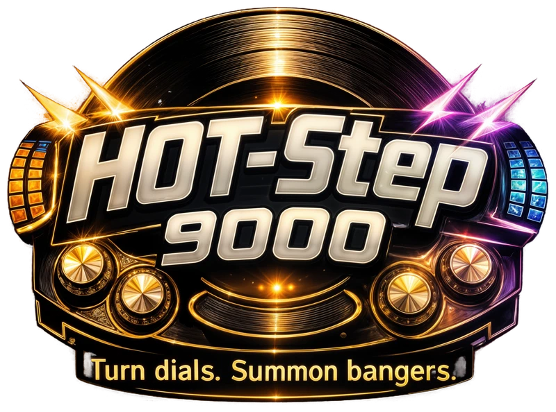

# HOT-Step 9000

**Local AI Music Generator for Windows**

*Summon bangers directly from your GPU.*

## About

**HOT-Step 9000** is a fully functional, open-source local AI music generation suite designed for Windows.

This project is a standalone frontend for [ACE-Step 1.5](https://github.com/ace-step/ACE-Step-1.5). It originally started as a fork of [sdbds/ACE-Step-1.5-for-windows](https://github.com/sdbds/ACE-Step-1.5-for-windows) but has since grown into its own distinct application with significant UI Overhauls, advanced features, and quality-of-life improvements.

### ⚠Work In Progress
This application is under active, ongoing development. You may occasionally encounter bugs or unoptimized features. We welcome bug reports and feature requests via GitHub Issues. 

While currently optimized and supported specifically for **Windows environments**, PRs contributing cross-platform support are welcome.

---

## Key Features

HOT-Step 9000 sits on top of the original ACE-Step backend but introduces a massive array of new tools and features for advanced AI music creation:

- **Auto-Mastering:** Every generated track can be automatically mastered with two options — a built-in 6-stage Processing Chain (EQ, saturation, stereo widening, compression, limiter) or reference-based mastering via [Matchering](https://github.com/sergree/matchering) with optional per-stem processing for superior tonal fidelity. Interactive console for real-time tweaks, persistent presets, and one-click remastering of existing tracks.
- **Advanced Multi-Adapter System:** Slot-based loading of up to 4 simultaneous LoRA/LoKr adapters with per-layer scaling via weight-space merging.
- **Activation Steering (TADA):** Experimental zero-shot generation guidance by modifying model activations directly.
- **Advanced Guidance & Solvers:** 7 guidance modes (including PAG, APG, ADG) and 6 ODE solvers (Euler, Heun, DPM++ 2M, RK4, JKASS, JKASS Fast) with per-solver parameter tuning. Advanced Guidance sub-panel for independent text/lyric scales, APG tuning, and guidance decay scheduling.
- **JKASS Inference Solvers:** Purpose-built music diffusion solvers with frequency damping, beat stability, and temporal smoothing — configurable per-generation via dedicated UI controls.
- **Custom VLLM Backend:** Third LM backend option with bespoke KV-cache pooling and optimized two-phase generation. Hot-switchable between PyTorch, standard VLLM, and Custom VLLM without restart.
- **Anti-Autotune:** Spectral smoothing to reduce robotic vocal artifacts in AI-generated music, with a simple 0–1 intensity slider.
- **Vocoder Enhancement (HiFi-GAN):** Optional high-quality audio decode pass using ADaMoSHiFiGAN for improved timbre and clarity. Downloads separately (~206 MB).
- **Timestep Scheduler:** 6 pluggable timestep distributions (Linear, DDIM, SGM, Bong Tangent, Linear Quadratic, Composite 2-Stage) for controlling where denoising effort is concentrated.
- **Cover Mode Tools:** Tempo scaling (0.5x–2.0x) and pitch shifting (±12 semitones) for covers and repaints, applied before VAE encoding.
- **Stem Extraction & Separation:** Both generative extraction (via DiT) and deterministic separation (BS-RoFormer/Demucs) with a built-in multi-track mixer.
- **Upscale to HQ:** Re-run low-step preview audio at higher quality settings using precomputed audio codes.
- **Melodic Variation:** Adjust the language model's repetition penalty for varied or hypnotic melodic phrasing.
- **Quality Scoring:** Automatic PMI and DiT alignment scores on every generated track.
- **Synced Lyrics & Live Visualizer:** Real-time Web Audio API visualizers (10 presets, configurable pool, fullscreen mode) with synced `.lrc` lyrics overlays and section markers.
- **A/B Track Comparison:** Side-by-side simultaneous playback of any two tracks with instant toggle and parameter diff view.
- **Layer Ablation Lab:** Developer tool for automated layer sweeps to isolate adapter functional impact across 24 transformer layers.
- **One-Click Launcher:** Interactive loading screen with model selection dropdowns, auto-continue timer, and real-time service health polling.
- **Model Hot-Switching:** Change LM and DiT models instantly without restarting the server, with dynamic model discovery from the checkpoints directory.
- **JSON Export/Import:** Save and share complete generation configurations including adapter and steering state.
- **Creation Panel Overhaul:** Reorganized from a single monolithic panel into ~13 modular accordion sections with Simple vs Custom modes.
- **Audio Enhancement Studio (Legacy):** Per-stem DSP engine with 6 presets, reverb, echo, stereo widening, and optional Demucs stem separation.
- **UI & QoL:** Persistent settings, debug panel with GPU/RAM/CPU monitoring, waveform visualizer, track list pagination, job cancellation, queue management, bulk operations, and a simple one-click shutdown.
- **AI Cover Art:** Optional AI-generated album artwork using SDXL Turbo. When enabled in Settings, each generated song receives a unique 512×512 cover image based on its title, style, and lyrics — generated locally on your GPU after audio completes.

*For a detailed, technical breakdown of every new feature, see [FEATURES.md](./FEATURES.md).*

---

## Installation & Usage

*(Assuming basic Python/CUDA knowledge and a suitable Windows GPU environment)*

1. Clone the repository.
2. Run `install.bat` to install dependencies.
3. Download applicable models into the `checkpoints/` directory.
4. Run `LAUNCH.bat` to start the application with the interactive loading screen.
5. In the UI, set your generation parameters, enter a prompt, and bring forth the **bangers**.

---

## Lineage & Credits

HOT-Step 9000 exists thanks to the incredible open-source AI audio community:

- Core models and initial application framework by the **[ACE-Step 1.5 Team](https://github.com/ace-step/ACE-Step-1.5)**.
- Windows compatibility layer and upstream scaffolding by **[sdbds](https://github.com/sdbds/ACE-Step-1.5-for-windows)**.
- UI Overhaul, advanced tooling, and new features by **scragnog**.

## License

This project inherits the licensing of its upstream parents. See original repositories for detailed model and code licensing. Please use AI generation tools responsibly.
